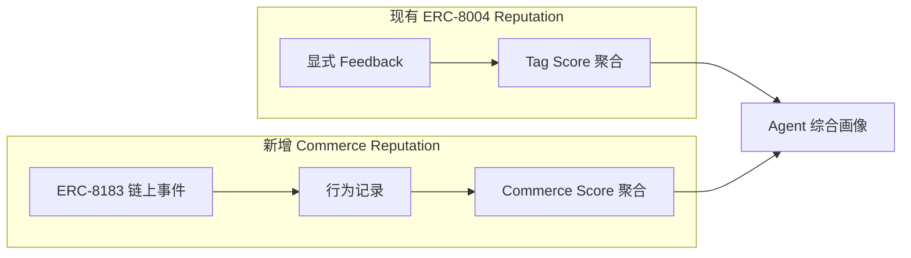
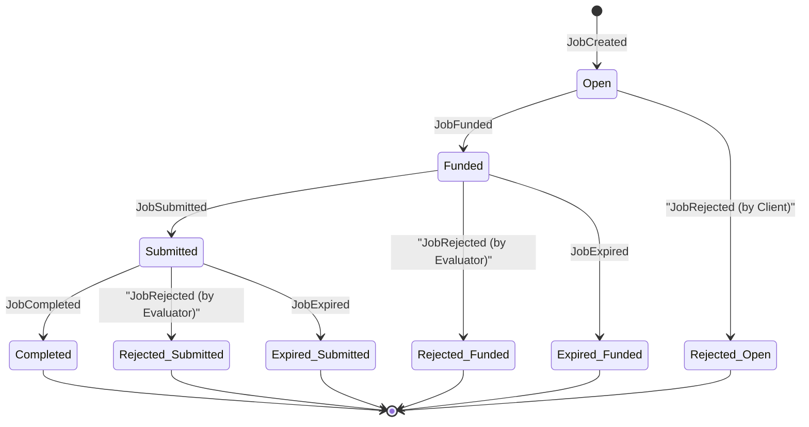
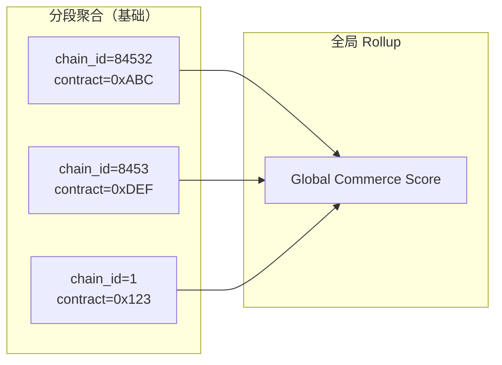
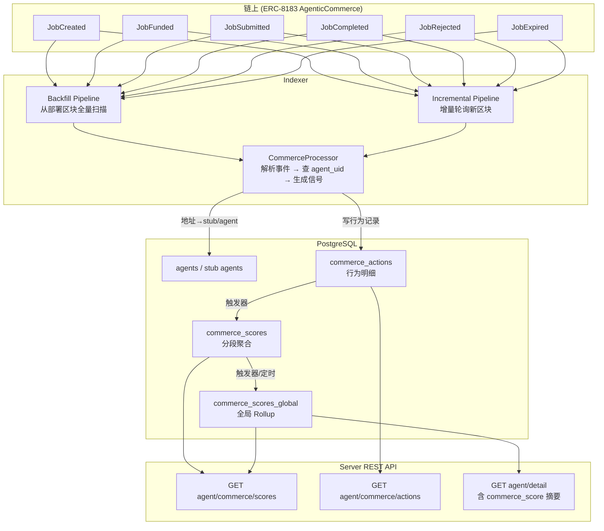
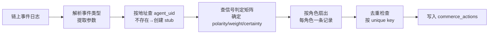

# ERC-8183 Commerce Reputation 系统架构设计

> 状态：Finalized  
> 创建日期：2026-04-02  
> 最后更新：2026-04-13  
> 关联规范：[ERC-8183 Agentic Commerce](../erc-8183/erc-8183.md)

---

## 一、背景与定位

现有 reputation 体系（`feedbacks` / `feedback_tag_scores`）基于 **ERC-8004 链上显式评价**——由第三方主动提交打分。这是一个"主观评价"维度。

ERC-8183 引入了 **Agentic Commerce**（作业托管协议），agent 在其中以 Client / Provider / Evaluator 三种角色参与。每个 job 最终会达到一个确定的终态（Completed / Rejected / Expired），这些终态以及到达终态的路径，构成了可被客观观测的 **链上行为记录**。

新维度的定位：**Commerce Reputation（商业信用）**——不依赖任何人的主观打分，纯粹从链上可验证的行为事实推导出的信用指标。



### 与现有 Reputation 体系的关系

| 维度 | 现有 Feedback (ERC-8004) | 新增 Commerce (ERC-8183) |
|------|-------------------------|------------------------|
| 数据来源 | 第三方主动提交评价 | 链上交易行为自动提取 |
| 主观/客观 | 主观打分 | 客观事实 |
| 可篡改性 | 依赖评价者诚信 | 不可篡改（链上终态） |
| 冷启动 | 需有人主动评价 | 只要参与 commerce 即有数据 |
| 信号颗粒度 | 自由 tag + 数值 | 固定行为类型 + 终态极性 |
| 存储 | feedbacks / feedback_tag_scores | commerce_actions / commerce_scores |
| 聚合层 | tag1 维度平均分 | role 维度成功率/加权分 |

两者互补，不互相替代。Agent 的综合画像中应同时展示两个维度。

---

## 二、关键策略决策

以下 5 项在架构设计阶段已决策锁定，贯穿后续所有章节。

| # | 问题 | 决策 | 理由 |
|---|------|------|------|
| D1 | 未注册地址如何处理 | **创建 Stub Agent**：为每个新出现的链上地址自动建立最小化主体（无 agent_uri、无 name，仅 wallet + chain_id），后续注册后自然归并 | 保证行为不丢、链上历史可完整回放；stub 可参与聚合与检索 |
| D2 | evaluator == client 时如何处理 | **角色分离**：即使同一地址同时担任 client 与 evaluator，同一事件也分别写两条行为记录，分别计入 client_score 与 evaluator_score | 保留"付款信用"和"评审履约"两种能力的可解释性；为第三方评审场景提供一致口径 |
| D3 | 跨链/多合约聚合 | **分段 + 全局 Rollup**：明细与计算以 `(chain_id, commerce_contract)` 为基础维度；同时提供全局汇总分 | 既能"一眼看总分"，也能"下钻看某条链/某个合约的表现" |
| D4 | Hook 行为是否纳入 | **仅核心事件打分，Hook 作为上下文**：打分只看 ERC-8183 核心合约的 6 类事件；在行为记录中附带 hook 地址字段用于过滤与解释 | 避免把 hook 的复杂可变逻辑引入评分，同时保留审计与风控筛选能力 |
| D5 | 历史回填 | **全量回填**：对每条链、每个合约从部署区块扫描到最新，之后转为增量索引 | 保证数据完整性，Commerce Score 从第一笔 job 开始计算 |

---

## 三、行为识别——哪些链上事件构成可观测行为

### 3.1 核心行为（参与 reputation 计算）

| # | 行为标识 | 触发事件 | 涉及角色 | 含义 |
|---|---------|---------|---------|------|
| 1 | `job_created` | `JobCreated` | Client | 发起了一笔新作业 |
| 2 | `job_funded` | `JobFunded` | Client | 为作业注入了资金（锁定到合约） |
| 3 | `job_submitted` | `JobSubmitted` | Provider | 完成工作并提交交付物等待评审 |
| 4 | `job_completed` | `JobCompleted` | Evaluator → 影响 Provider/Client/Evaluator | 评审通过，资金释放给 Provider |
| 5 | `job_rejected` | `JobRejected` | Client（from Open）或 Evaluator（from Funded/Submitted） | 作业被驳回 |
| 6 | `job_expired` | `JobExpired` | 无主动方（任何人可触发） | 作业超时，资金退回 Client |

### 3.2 审计行为（仅记录不打分）

| # | 行为标识 | 触发事件 | 说明 |
|---|---------|---------|------|
| 7 | `provider_set` | `ProviderSet` | 协商阶段，不影响信任信号 |
| 8 | `budget_set` | `BudgetSet` | 协商阶段，不影响信任信号；**额外捕获 `payment_token` / `token_symbol` / `budget_usd` 快照** |

### 3.3 结算类事件（不参与 score 聚合，用于 Job 资金事实快照）

合约在 `complete()` 中会 emit 结算拆分事件（见 `AgenticCommerce.sol`），用于记录**真实发生的资金转移事实**：

| 事件 | 用途 | 说明 |
| --- | --- | --- |
| `PaymentReleased(jobId, provider, amount)` | provider 实收净额（net） | `paid_amount`/`paid_amount_usd` 的事实来源 |
| `PlatformFeePaid(jobId, treasury, amount)` | 平台费 | `platform_fee_amount`/`platform_fee_usd` 来源 |
| `EvaluatorFeePaid(jobId, evaluator, amount)` | 评审费 | `evaluator_fee_amount`/`evaluator_fee_usd` 来源 |

> 实现说明（与最新代码一致）：结算拆分通过 `FilterLogs` 直接订阅这些事件并写入 `commerce_jobs` 快照字段，避免逐笔调用 `eth_getTransactionReceipt` 扫描 logs。

### 3.3 行为生命周期图



---

## 四、信号判定——行为到信用信号的映射

### 4.1 信号三维度

每条行为对参与该 job 的每个角色产生一个信号，信号由三个维度描述：

- **极性（polarity）**：`positive` / `negative` / `neutral`
- **强度（weight）**：0.0 ~ 1.0（终态事件基准 1.0，过程事件基准 0.3，可叠加金额因子）
- **确定性（certainty）**：`definitive`（终态事件，不可逆）/ `indicative`（过程事件，可被后续终态覆盖）

### 4.2 终态信号判定矩阵

终态是 reputation 的**核心信号来源**。一个 job 有且仅有一个终态，对应一组信号：

| 终态 | 到达路径 | Provider 信号 | Client 信号 | Evaluator 信号 |
|------|---------|--------------|------------|---------------|
| **Completed** | Submitted → Completed | **positive** / 1.0 / definitive | **positive** / 1.0 / definitive | **neutral** / 0.5 / definitive |
| **Rejected (from Open)** | Open → Rejected (by Client) | 不记录（未参与资金流） | **neutral** / 0.2 / definitive | 不记录 |
| **Rejected (from Funded)** | Funded → Rejected (by Evaluator) | **negative** / 0.5 / definitive | **neutral** / 0.3 / definitive | **neutral** / 0.5 / definitive |
| **Rejected (from Submitted)** | Submitted → Rejected (by Evaluator) | **negative** / 1.0 / definitive | **neutral** / 0.3 / definitive | **neutral** / 0.5 / definitive |
| **Expired (from Funded)** | Funded → Expired | **negative** / 1.0 / definitive | **neutral** / 0.3 / definitive | 不记录 |
| **Expired (from Submitted)** | Submitted → Expired | **neutral** / 0.3 / definitive | **negative** / 0.5 / definitive | **negative** / 0.7 / definitive |

> **读表说明**：每格格式为 `极性 / 强度 / 确定性`。"不记录"表示该角色在此路径下无需产生行为记录行。

### 4.3 过程信号判定

过程事件产生 `indicative` 信号——在终态到达后会被终态信号覆盖：

| 行为 | 角色 | 极性 | 强度 | 确定性 | 说明 |
|------|------|------|------|--------|------|
| `job_created` | Client | neutral | 0.1 | indicative | 活跃度指标 |
| `job_funded` | Client | positive | 0.3 | indicative | 实际锁定资金，显示付款意愿 |
| `job_submitted` | Provider | positive | 0.3 | indicative | 完成了工作提交，结果未定 |

### 4.4 角色分离规则（D2 落地）

对于同一个终态事件，系统按**参与该 job 的每个角色**分别生成行为记录行：

- 一个 `JobCompleted` 事件 → 最多产生 **3 条**行为记录（Provider 1 条 + Client 1 条 + Evaluator 1 条）
- 当 `evaluator == client` 时，仍写 2 条（client 角色 1 条 + evaluator 角色 1 条），它们的 `agent_uid` 相同但 `role` 不同
- 当 `evaluator == provider` 时，同理

---

## 五、Commerce Score 计算模型

### 5.1 按角色分离的三个子分数

```
Commerce Score = {
    provider_score,     // 服务交付信用
    client_score,       // 委托方信用
    evaluator_score     // 评审方信用
}
```

三个 score 完全独立计算，互不影响。

### 5.2 Provider Score（核心指标）

**基础指标——Success Rate：**

```
provider_success_rate = completed_count / terminal_count
```

其中 `terminal_count = completed_count + rejected_count + expired_responsible_count`，`expired_responsible_count` 仅计入 Funded→Expired（provider 有责的过期）。

**加权指标——Volume-Weighted Score：**

- **原生代币加权**（展示用）：
  ```
  provider_weighted_score_raw = Σ(job_budget × outcome_score) / Σ(job_budget)
  ```
- **USD 加权**（跨 token 可比）：
  ```
  provider_weighted_score_usd = Σ(budget_usd × outcome_score) / Σ(budget_usd)
  ```

`outcome_score` 映射：

| 终态路径 | outcome_score |
|---------|--------------|
| Completed | 1.0 |
| Rejected (from Submitted) | 0.0 |
| Rejected (from Funded) | 0.2 |
| Expired (from Funded) | 0.0 |

**辅助统计量：**

| 统计量 | 说明 |
|--------|------|
| `total_jobs` | 作为 Provider 参与的总 job 数 |
| `total_volume` | 原生代币总量（保留用于展示原始数额 + symbol） |
| `total_volume_usd` | USD 计价总交易量（跨 token 可比） |
| `unique_clients` | 服务过的独立 client 地址数 |

### 5.3 Client Score

**基础指标：**

```
client_funded_rate = funded_count / created_count         // 付款率
client_completion_rate = completed_count / funded_count    // 结案率
```

**辅助统计量：** `total_jobs`, `total_volume`, `unique_providers`

### 5.4 Evaluator Score

**基础指标：**

```
evaluator_responsiveness = evaluated_count / (evaluated_count + expired_from_submitted_count)
```

其中 `evaluated_count = completed_by_evaluator + rejected_by_evaluator`（evaluator 主动给出终态的次数），`expired_from_submitted_count` = Submitted→Expired 的次数。

**辅助统计量：** `total_evaluations`, `unique_jobs_evaluated`

### 5.5 置信度与冷启动

每个 score 附带一个 **confidence** 值：

```
confidence = min(terminal_job_count / THRESHOLD, 1.0)
```

- `THRESHOLD` 初始值：**5**（终态 job 数达到 5 笔后 confidence = 1.0）
- 前端展示：confidence < 1.0 时标注"数据不足"
- 聚合查询：可按 `confidence >= X` 过滤低质量分数

### 5.6 聚合粒度（D3 落地）



- **分段聚合**：以 `(agent_uid, role, chain_id, commerce_contract)` 为主键
- **全局 Rollup**：以 `(agent_uid, role)` 为主键，跨链跨合约的汇总值
- 全局 Rollup 的 `success_rate` / `weighted_score` 直接从全部行为记录重算（非分段分数的平均值）

---

## 六、行为记录结构

### 6.1 核心记录表：`commerce_actions`

每条记录 = **一个链上事件 × 一个角色 × 一个信号**。

| 字段分类 | 字段名 | 类型 | 说明 |
|---------|--------|------|------|
| **主键** | `uid` | serial | 自增主键 |
| **身份** | `chain_id` | varchar | 链 ID |
| | `commerce_contract` | varchar | AgenticCommerce 合约地址 |
| | `job_id` | bigint | 链上 job ID |
| **角色** | `agent_uid` | bigint | 本系统 agent UID（含 stub agent） |
| | `agent_address` | varchar | 链上地址（冗余，便于 stub 关联） |
| | `role` | varchar | `client` / `provider` / `evaluator` |
| **行为** | `action` | varchar | `job_created` / `job_funded` / `job_submitted` / `job_completed` / `job_rejected` / `job_expired` / `provider_set` / `budget_set` |
| **信号** | `signal_polarity` | varchar | `positive` / `negative` / `neutral` |
| | `signal_weight` | numeric(4,2) | 0.00 ~ 1.00 |
| | `signal_certainty` | varchar | `definitive` / `indicative` |
| **上下文** | `job_budget` | numeric(36,8) | job 金额（原生代币数量） |
| | `payment_token` | varchar | ERC-20 代币地址，从 `BudgetSet` 事件直接解析，`0x0` 表示 ETH |
| | `token_symbol` | varchar | 代币符号（USDC/WETH/ETH），从 ERC20 `symbol()` 读取并缓存 |
| | `budget_usd` | numeric(36,8) | **快照值**——BudgetSet 时的 USD 价值，用于跨 token 加权 |
| | `counterparty` | varchar | 对手方地址（Provider 视角填 Client，反之亦然） |
| | `reason` | varchar | complete/reject 的 bytes32 reason |
| | `deliverable` | varchar | submit 的 bytes32 deliverable |
| | `previous_status` | varchar | reject/expire 时的前序状态（`open`/`funded`/`submitted`） |
| | `hook_address` | varchar | job 关联的 hook 合约地址，`0x0` 表示无 hook（D4 落地） |
| **溯源** | `block_number` | bigint | 区块高度 |
| | `tx_hash` | varchar | 交易哈希 |
| | `log_index` | integer | 日志索引 |
| | `block_timestamp` | bigint | 区块时间戳 |
| **系统** | `created_at` | timestamp | 记录写入时间 |

**去重键**：`(chain_id, commerce_contract, job_id, role, action, block_number, log_index)`  
同一事件对同一角色同一行为类型只写入一次。

### 6.2 分段聚合表：`commerce_scores`

主键：`(agent_uid, role, chain_id, commerce_contract)`

| 字段名 | 类型 | 说明 |
|--------|------|------|
| `agent_uid` | bigint | |
| `role` | varchar | `provider` / `client` / `evaluator` |
| `chain_id` | varchar | |
| `commerce_contract` | varchar | |
| **Provider 字段** | | |
| `completed_count` | integer | |
| `rejected_count` | integer | |
| `expired_responsible_count` | integer | |
| `success_rate` | numeric(6,4) | |
| `weighted_score` | numeric(6,4) | |
| `total_volume` | numeric(36,8) | 原生代币总量（保留以展示原始数额） |
| `total_volume_usd` | numeric(36,8) | USD 计价总交易量，用于跨 token 汇总 |
| `weighted_volume_sum` | numeric(36,8) | Σ(budget × outcome_score)，用于增量更新 weighted_score |
| `weighted_volume_usd_sum` | numeric(36,8) | Σ(budget_usd × outcome_score)，用于 USD 加权 score 计算 |
| `unique_counterparties` | integer | Provider→unique clients, Client→unique providers |
| **Client 字段** | | |
| `created_count` | integer | |
| `funded_count` | integer | |
| `funded_rate` | numeric(6,4) | |
| `completion_rate` | numeric(6,4) | |
| **Evaluator 字段** | | |
| `evaluated_count` | integer | |
| `expired_from_submitted_count` | integer | |
| `responsiveness` | numeric(6,4) | |
| **通用** | | |
| `total_jobs` | integer | |
| `confidence` | numeric(4,2) | |
| `updated_at` | timestamp | |

> 不同角色共享同一张表但只使用各自对应的字段；其余字段保持 NULL 或 0。

### 6.3 全局 Rollup 表：`commerce_scores_global`

主键：`(agent_uid, role)`

字段结构与 `commerce_scores` 完全相同，去掉 `chain_id` 和 `commerce_contract`。值为跨链跨合约的汇总。

### 6.4 检索索引

| 查询场景 | 索引 |
|---------|------|
| 某 agent 的所有商业行为 | `(agent_uid, action)` |
| 某 agent 作为特定角色的行为 | `(agent_uid, role, action)` |
| 某个 job 的全部行为链 | `(chain_id, commerce_contract, job_id)` |
| 按时间范围查行为 | `(agent_uid, block_timestamp)` |
| 某 agent 与特定对手方的交互 | `(agent_uid, counterparty)` |
| 仅查终态信号 | `(agent_uid, signal_certainty)` where `= 'definitive'` |
| 按 hook 地址过滤 | `(hook_address)` where `!= '0x0'` |
| 按 payment_token 过滤 | `(payment_token)` |
| 按 token_symbol 过滤 | `(token_symbol)` |
| 去重检查 | `UNIQUE(chain_id, commerce_contract, job_id, role, action, block_number, log_index)` |

---

## 七、数据流架构

### 7.1 整体数据流



### 7.2 Indexer 处理流程



**关键流程说明：**

1. **事件解析**：从 `FilterLogs` 结果中按 topic 识别 6 类核心事件 + 2 类审计事件
2. **身份查找**：用事件中的 `client`/`provider`/`evaluator` 地址查 `agents` 表；若不存在则按 D1 策略创建 stub agent
3. **信号生成**：按第四章信号判定矩阵，确定每个角色的 `(polarity, weight, certainty)`
4. **角色扇出**：一个终态事件对最多 3 个角色各生成一条记录（按 D2 角色分离策略）
5. **去重写入**：按 unique key 做幂等写入

### 7.3 聚合更新策略

- **分段聚合**（`commerce_scores`）：由 DB 触发器在 `commerce_actions` INSERT 时增量更新
  - 仅 `signal_certainty = 'definitive'` 的记录参与聚合
  - `weighted_score` 通过 `weighted_volume_sum / total_volume` 增量计算
  - `unique_counterparties` 通过子查询 `COUNT(DISTINCT counterparty)` 更新
  - `confidence` 在每次更新时重算 `min(terminal_count / 5, 1.0)`
- **全局 Rollup**（`commerce_scores_global`）：由定时任务或 `commerce_scores` 触发器更新
  - 对同一 `(agent_uid, role)` 的所有分段行汇总

### 7.4 回填策略（D5 落地）

```
对每条链:
  对每个已配置的 AgenticCommerce 合约:
    start_block = 合约部署区块
    end_block   = 当前最新区块
    分批拉取事件 (batch_size = 2000 blocks)
    走正常 CommerceProcessor 处理流程
    记录最后处理的区块号到 exec_block 表
  切换为增量模式
```

---

## 八、展示实体模型

### 8.1 实体定义

Commerce Reputation 的展示主体为 **Agent（UID）**，一级维度为 **Role**：

```
展示主体 = Agent（UID）
一级维度 = Role（provider / client / evaluator）
展示单元 = (agent_uid, role)  ← 对应 commerce_scores_global 的主键
```

同一 Agent 在不同角色下拥有完全独立的分数、行为列表和交易对手统计。展示时按角色分 tab 或分卡片，只展示有数据的角色。

### 8.2 方案决策理由

| 备选方案 | 结论 | 原因 |
|---------|------|------|
| Agent（UID）为主体 + Role 为维度 | **采用** | 与现有 feedback/validation 体系一致；`commerce_scores_global` PK 就是 `(agent_uid, role)`；查询索引已优化 |
| (UID + Role) 作为独立实体 | 不采用 | 本质上是同一 agent 的切面，不应建立独立实体概念 |
| Address 为主体 | 不采用 | 与 UID 体系割裂；通过 stub agent 机制地址已映射到 UID |

### 8.3 展示结构总览

```
Agent (uid=123)
├── Provider Tab （仅当 total_jobs > 0 时显示）
│   ├── Score 卡片
│   ├── 统计摘要
│   └── 行为列表（表格 + 分页 + 过滤）
├── Client Tab （仅当 total_jobs > 0 时显示）
│   ├── Score 卡片
│   ├── 统计摘要
│   └── 行为列表
└── Evaluator Tab （仅当 total_jobs > 0 时显示）
    ├── Score 卡片
    ├── 统计摘要
    └── 行为列表
```

所有 role 均无数据时，Commerce 区域显示"暂无商业行为记录"。

### 8.4 Provider Tab 展示

**Score 卡片（核心指标，一眼可见）**

| 指标 | 来源字段 | 展示格式 |
|------|---------|---------|
| 成功交付率 | `success_rate` | 百分比（如 92.5%） |
| 金额加权得分 | `weighted_score` | 百分比 |
| 置信度 | `confidence` | < 1.0 时标注"数据不足，已完成 N/5 笔" |

**统计摘要（次要信息行）**

| 统计量 | 来源字段 | 说明 |
|--------|---------|------|
| 终态分布 | `completed_count` / `rejected_count` / `expired_responsible_count` | 可用环形图展示三段比例 |
| 总 Job 数 | `total_jobs` | |
| 总交易金额 | `total_volume` | 带 token 单位 |
| 独立 Client 数 | `unique_counterparties` | |

**行为列表（表格 + 分页）**

每行字段：

| 列名 | 来源字段 | 说明 |
|------|---------|------|
| 时间 | `block_timestamp` | 转为人类可读时间 |
| Job | `job_id` | 链接到 job 详情（chain_id + contract + job_id） |
| 行为 | `action` | 标签色：completed=绿, rejected=红, expired=灰, submitted=蓝 |
| 信号 | `signal_polarity` + `signal_weight` | 如 "+1.0" 绿色 / "-0.5" 红色 / "0.3" 灰色 |
| 金额 | `job_budget` | |
| 对手方 | `counterparty` | 显示 client 地址/名称（若已注册） |
| 前序状态 | `previous_status` | 仅终态行有值（如 "from Funded"） |
| Hook | `hook_address` | 非 0x0 时显示 hook 标签 |
| Tx | `tx_hash` | 链接到区块浏览器 |

过滤器：

| 过滤维度 | 类型 | 选项 |
|---------|------|------|
| 行为类型 | 多选 | job_completed / job_rejected / job_expired / job_submitted |
| 信号极性 | 多选 | positive / negative / neutral |
| 确定性 | 单选 | 全部 / 仅终态（definitive） / 仅过程（indicative） |
| 时间范围 | 日期区间 | 起止日期 |
| 金额范围 | 数值区间 | 最小 / 最大 budget |
| Hook 过滤 | 开关 | 仅有 hook / 仅无 hook |

### 8.5 Client Tab 展示

**Score 卡片**

| 指标 | 来源字段 | 展示格式 |
|------|---------|---------|
| 付款率 | `funded_rate` | 百分比（funded / created） |
| 结案率 | `completion_rate` | 百分比（completed / funded） |
| 置信度 | `confidence` | 同 Provider |

**统计摘要**

| 统计量 | 来源字段 |
|--------|---------|
| 创建 / 已付款 / 已完成 | `created_count` / `funded_count` / `completed_count` |
| 总 Job 数 | `total_jobs` |
| 总交易金额 | `total_volume` |
| 独立 Provider 数 | `unique_counterparties` |

**行为列表**

表格结构与 Provider Tab 完全相同，区别：

- `counterparty` 列显示 provider 地址/名称
- 包含 `job_created`（indicative）和 `job_funded`（indicative）行为
- 默认包含 indicative 行为（created/funded 对 client 有意义）

过滤器：同 Provider Tab，行为类型增加 `job_created` / `job_funded`。

### 8.6 Evaluator Tab 展示

**Score 卡片**

| 指标 | 来源字段 | 展示格式 |
|------|---------|---------|
| 评审响应率 | `responsiveness` | 百分比 |
| 置信度 | `confidence` | 同上 |

**统计摘要**

| 统计量 | 来源字段 |
|--------|---------|
| 已评审次数 | `evaluated_count`（completed + rejected 的总和） |
| 超时未评审 | `expired_from_submitted_count` |
| 总 Job 数 | `total_jobs` |
| 独立 Provider 数 | `unique_counterparties` |

**行为列表**

表格结构同上，区别：

- 仅包含终态行为：job_completed / job_rejected / job_expired
- `counterparty` 列显示 provider 地址/名称
- 默认过滤：仅 definitive 信号

### 8.7 通用展示规则

**排序**

| 排序方式 | 字段 | 说明 |
|---------|------|------|
| 默认 | `block_timestamp DESC` | 最新在前 |
| 按金额 | `job_budget DESC` | 可切换 |
| 按信号强度 | `signal_weight DESC` | 可切换 |

**分页**

- 默认 `page_size = 20`
- 最大 `page_size = 100`

**空状态**

- 某 role 的 `total_jobs = 0` → 该 tab 不显示
- 所有 role 均无数据 → Commerce 区域显示"暂无商业行为记录"

### 8.8 地址搜索入口

对于未注册的 stub agent 或通过地址搜索的场景：

1. 用户输入地址 → 查 `agents.agent_wallet` 反查 `uid`
2. 找到 uid 后走同一展示路径
3. Stub agent 的详情页标注"未注册"，仅展示 commerce 行为数据

---

## 九、API 接口概览

| 方法 | 路径 | 参数 | 返回 |
|------|------|------|------|
| GET | `agent/commerce/scores` | `uid`, 可选 `chain_id`, `commerce_contract` | 全局 rollup 或指定合约的分段聚合；含 provider_score / client_score / evaluator_score 及各辅助统计量和 confidence |
| GET | `agent/commerce/actions` | `uid`, 可选 `role`, `action`, `chain_id`, `commerce_contract`, `counterparty`, `certainty`, `hook_address`, `page`, `page_size`, `sort_by`, `min_budget`, `max_budget`, `start_time`, `end_time` | 行为明细列表（分页），支持 8.4~8.7 定义的全部过滤与排序 |
| GET | `agent/detail` | `uid` | 现有 agent 详情 + 新增 `commerce_score` 摘要字段（全局 rollup 的 provider_score / client_score / evaluator_score / confidence） |

---

## 十、Stub Agent 机制（D1 落地）

当 CommerceProcessor 在事件中发现一个地址（client/provider/evaluator），且该地址在 `agents` 表中不存在时：

1. 创建一条 stub agent 记录：
   - `agent_wallet` = 该地址
   - `chain_id` = 事件所在链
   - `name` = 空
   - `agent_uri` = 空
   - `active` = false（标记为 stub）
2. 使用返回的 `agent_uid` 写入 `commerce_actions`
3. 当该地址后续通过 Identity Registry 注册时：
   - 补全 `name`、`agent_uri` 等字段
   - 将 `active` 设为 true
   - 历史 `commerce_actions` 和 `commerce_scores` 中的 `agent_uid` 无需更改（已经是同一个 uid）
